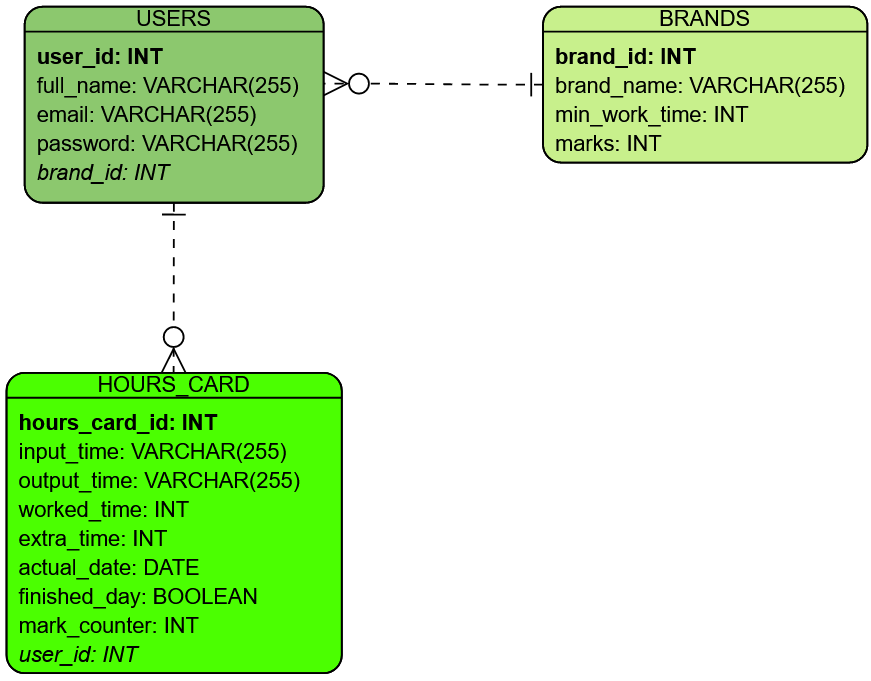

<h1 align="center">batpontoproject-backend</h1>
<p align="center">
    
</p>

### Topics
:small_blue_diamond: [About](#about-book)  
:small_blue_diamond: [ERD](#erd-clipboard)  
:small_blue_diamond: [Running Application](#running-application-arrow_forward)  
:small_blue_diamond: [Developers Team](#developers-team-octocat)  

## About :book:
<p align="justify">
    This project consists fo creating an app that simulates a company's "punch clock", using React Native with Spring features for login authentication and DB access.
</p>
<p align="center">
    <a href="https://www.java.com" target="_blank">
        
    </a>
    <a href="https://spring.io" target="_blank">
        
    </a>
    <a href="https://code.visualstudio.com" target="_blank">
        
    </a>
    <a href="https://www.jetbrains.com/idea" target="_blank">
        
    </a>
    
</p>

## ERD :clipboard:
<p align="center">
    
</p>

:exclamation: Run `create.sql` and `insert.sql` scripts to create the DB tables.

## Running Application :arrow_forward:
First, clone this repository:
```
git clone https://github.com/LeoLCM/batpontoproject-backend.git
```
In the project folder, install dependencies:
```
mvn install
```
Run Maven with Spring Boot:
```
mvn clean spring-boot:run
```
:warning: Don't forget to configure your DB on `application.properties` file:
```
spring.datasource.url=${DATABASE_URL}
spring.datasource.username=${DATABASE_USERNAME}
spring.datasource.password=${DATABASE_PASSWORD}
```

## Developers Team :octocat:
| [<br><sub>Leonardo Cesar</sub>](https://github.com/LeoLCM) |  [<br><sub>Matheus Messias</sub>](https://github.com/MatheusLMessias) |
| :---: | :---: 
<p align="center">
    <a href="./LICENSE" target="_blank">
        
    </a>
    <br>
    Copyright © 2022 - BatPonto
</p>
